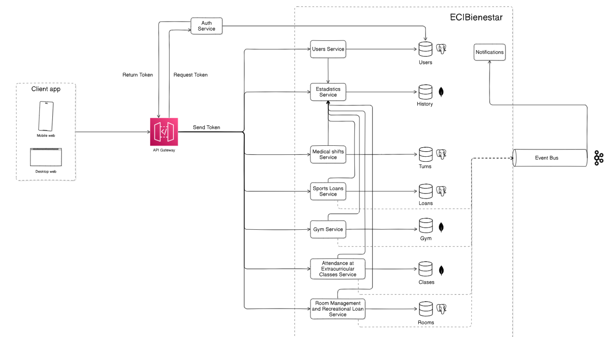
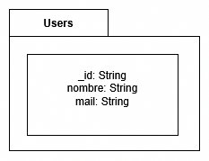
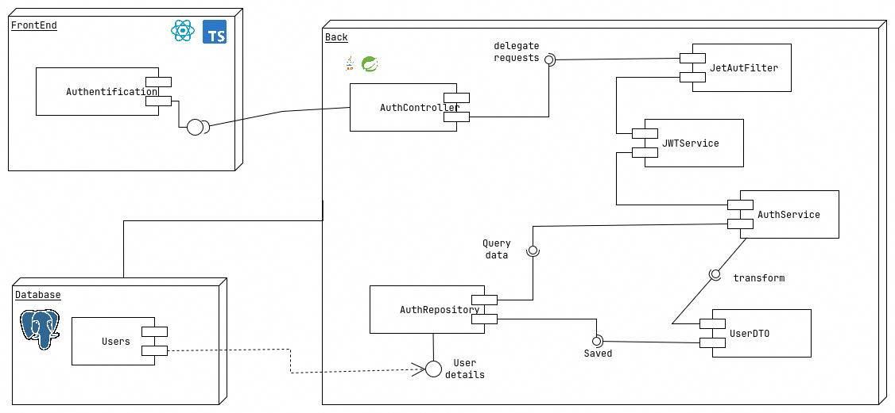
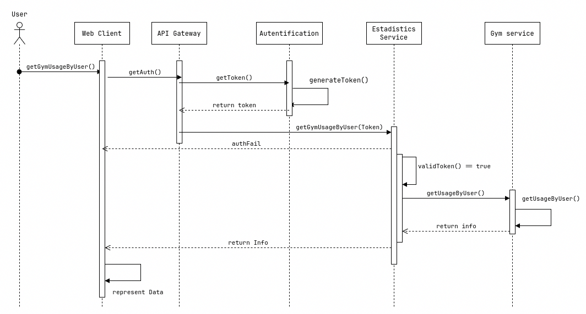
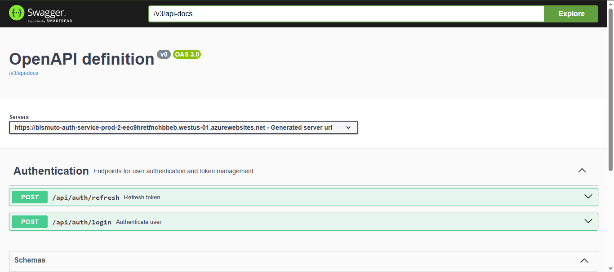

# ECI-Bienestar Authentication Service

Authentication microservice for the ECI-Bienestar platform. Handles user authentication, authorization, JWT token management, and security for Escuela Colombiana de Ingeniería Julio Garavito's wellness system.

## 👥 Authors

* Andrés Felipe Chavarro Plazas
* Andrés Jacobo Sepúlveda Sánchez
* Camilo Andrés Fernández Días
* Jesús Alfonso Pinzón Vega

## 📌 Project Overview
This microservice is part of the ECI-Bienestar integrated platform designed for Escuela Colombiana de Ingeniería Julio Garavito. The Authentication Service is built using **Spring Boot** and provides secure user authentication, JWT token management, and role-based access control for the wellness system.

## 🛠️ Technologies Used
- **Java 17**
- **Spring Boot 3.x** (Spring Security, Spring Web)
- **MongoDB** (NoSQL Database)
- **Maven**
- **Lombok**
- **JUnit 5 & Mockito** (for testing)
- **JaCoCo** (for code coverage)
- **SonarCloud** (for code quality)
- **JWT** (for secure authentication)

## 🔗 Microservices diagram



## 📂 Project Structure

```
bismuto-auth-service/
├── pom.xml
├── .gitignore
├── README.md
├── assets/
└── src/
    ├── main/
    │   ├── java/
    │   │   └── edu/eci/cvds/auth/
    │   │       ├── AuthServiceApplication.java
    │   │       ├── config/            # Configuration classes
    │   │       ├── controller/        # REST Controllers
    │   │       ├── dto/               # Data Transfer Objects
    │   │       │   └── enum/          # Enumerations
    │   │       ├── exception/         # Custom Exception Handling
    │   │       ├── model/             # Entity Classes
    │   │       ├── security/          # Security configurations and JWT handling
    │   │       ├── service/           # Business Logic Services
    │   │       └── util/              # Utility classes
    │   └── resources/
    │       ├── application.properties       # Default configuration
    │       ├── application-dev.properties   # Development configuration
    │       ├── application-prod.properties  # Production configuration
    │       ├── static/                      # Static resources
    │       └── templates/                   # Templates
    └── test/
        └── java/
            └── edu/eci/cvds/auth/
                ├── AuthServiceApplicationTest.java
                ├── controller/       # Controller Tests
                ├── dto/              # DTO Tests
                │   └── enum/         # Enum Tests
                ├── exception/        # Exception Tests
                ├── model/            # Model Tests
                ├── security/         # Security Tests
                ├── service/          # Service Tests
                └── util/             # Utility Tests
```

## 📐 Architectural style


## ⚙️ Internal functioning


## 🚀 How to Run the Project

### Prerequisites
- Install **Java 17**
- Install **Maven**
- Set up a **MongoDB** database

### Steps to Run

1. Clone the repository:
   ```bash
   git clone https://github.com/ECIBienestar/bismuto-auth-service.git
   cd bismuto-auth-service
   ```

2. Configure database connection in `application.properties`:
   ```properties
   spring.data.mongodb.uri=mongodb://localhost:27017/eci_bienestar_auth
   spring.data.mongodb.database=eci_bienestar_auth
   ```

3. Build and run the application:
   ```bash
   mvn clean install
   mvn spring-boot:run
   ```


## 📑 Diagrams
Some of the diagrams proposed for this module are the following, which will help us to have a clear idea of ​​how the system works and is constructed:


### Data
Shows the structure of data within the system, including entities, attributes, and their relationships. It is useful for database design and understanding how data is organized and linked.




### Components
Illustrates the physical and software components of a system and how they are grouped and connected. It helps visualize the architecture and module distribution of the application.




### Secuence
Describes how objects interact in a specific sequence of events over time. It focuses on the order of messages exchanged between objects to accomplish particular use cases or functions.




## 📌 API Endpoints

### AuthenticationController Management

| Method | Endpoint               | Description                               |
|--------|------------------------|-------------------------------------------|
| POST   | /api/auth/login        | Authenticate user and generate JWT token  |
| POST   | /api/auth/refresh      | Refresh an existing JWT token             |
| POST   | /api/auth/logout       | Invalidate user's JWT token               |

## 🧪 Running Tests

To run the unit tests:
```bash
mvn test
```

To generate test coverage report:
```bash
mvn test jacoco:report
```

## 🔄 CI/CD

This project uses GitHub Actions to automate building, testing, and deployment:

- **Development Pipeline**: Triggered by commits to `develop` and `feature/*` branches, automatically deploying to the development environment.
- **Production Pipeline**: Triggered by commits to the `main` branch, deploying to the production environment after successful tests.

Each pipeline consists of three stages:
1. **Build**: Compiles the application and creates the JAR package
2. **Test**: Runs unit tests and generates code coverage reports
3. **Deploy**: Deploys the application to the AWS environment

Configuration files are located in the `.github/workflows/` directory.

Here is an example of the CI/CD pipeline for the development environment:
CI pipeline:
[CI pipeline](docs/ci-pipeline.png)

CD pipeline:
[CD pipeline](docs/cd-pipeline.png)

## 📦 Swagger documentation deployed
The Swagger documentation for the API is automatically generated and can be accessed at the following URL:
Production:
```
http://bismuto-auth-service-prod-2-eec9hretfnchbbeb.westus-01.azurewebsites.net/swagger-ui/index.html
```

Development:
```
http://bismuto-auth-service-dev-2-h5a8e5a5g2buf9hq.brazilsouth-01.azurewebsites.net/swagger-ui/index.html
```

This documentation provides a user-friendly interface to explore the API endpoints, request/response models, and test the API directly from the browser.

Deployment is managed through Azure App Service, ensuring high availability and scalability.
Here's an example of the Swagger documentation:


## 🔄 Integration with Other Modules

This authentication service integrates with other ECI-Bienestar modules:
- **User Management Service**: For user profile information and role management
How this module work with other modules?:
This module is integrated with other modules in the ECI-Bienestar platform to provide a seamless user experience. This module also follows the microservices architecture, allowing it to communicate with other services through REST APIs.
- **Statistics Service**: For logging authentication events
How this module work with other modules?:
This module is integrated with the Statistics Service to log authentication events, such as successful logins, failed login attempts, and token refreshes. This integration helps in monitoring user activity and identifying potential security threats.
- **All other services**: For validating user access and permissions
How this module work with other modules?:
This module is integrated with all other services in the ECI-Bienestar platform to validate user access and permissions. Each service checks the JWT token provided by the user to ensure that they have the necessary permissions to access specific resources or perform certain actions.

## Control of errors
The module has been designed to handle errors and exceptions effectively. It uses a centralized exception handling mechanism to catch and respond to errors in a consistent manner. The following types of errors are handled:
- **Authentication Errors**: Invalid credentials, expired tokens, etc.
- **Authorization Errors**: Insufficient permissions to access resources
- **Validation Errors**: Invalid input data
- **Database Errors**: Issues with PostgreSQL connection or queries
- **General Errors**: Any unexpected errors that occur during processing
- **Custom Error Responses**: The module returns meaningful error messages and HTTP status codes to the client, making it easier to understand the nature of the error and how to resolve it.

Heres a table with the errors and their respective messages:

| Status Code | 	Error Message            | 	Probable Cause               | 	Recommended Action                     | 
|-------------|---------------------------|-------------------------------|-----------------------------------------|
| 400         | 	"Invalid input data"     | 	Failed form validations      | 	Check all required fields and formats  |
| 401         | 	"Invalid credentials"    | 	Incorrect username/password  | 	Verify login details and try again     |
| 404         | 	"User not found"         | 	User doesn't exist in system | 	Check username or register new account |
| 500         | 	"Internal server error"  | 	Unexpected system failure    | 	Contact support with error details     |

## 🏗️ Future Improvements

- Multi-factor authentication
- OAuth2 integration for third-party authentication
- Enhanced security auditing and monitoring
- Password policy management

## 📝 License

This project is licensed under the MIT License.
